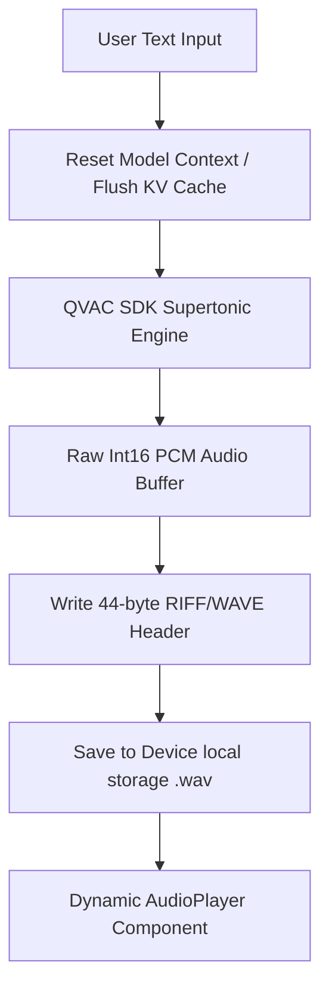

# 📱 Offline Mobile Text-to-Speech (TTS) with QVAC

An Expo/React Native companion application demonstrating high-fidelity, private, completely offline Text-to-Speech (TTS) powered by the [QVAC SDK](https://docs.qvac.tether.io/).

This project is the complete codebase for the guide: **"How to Run Private Text-to-Speech on Your Own Hardware Using QVAC"**.

---

## ⚡ Core Features

- **Zero Cloud Cost**: 100% on-device local speech synthesis—no API calls, subscriptions, or paywalls.
- **Privacy-First**: Inputs never leave the user's physical sandbox; works completely offline (airplane mode).
- **Supertonic Engine**: High-fidelity 44.1 kHz diffusion-based latent denoising audio generation.
- **Dynamic Waveform Player**: WhatsApp-inspired visual waveform playback with interactive seeking and speed control.
- **Pristine State Management**: Clean memory disposal via explicit unloading and reloading of active weights to prevent acoustic hallucinations.

---

## 🛠️ Architecture Overview

The application utilizes QVAC's hardware-bound bindings to load quantized neural models directly into mobile memory:



---

## 🚀 Getting Started

### 📋 Prerequisites

To run this application locally on physical devices or simulators, you need:

- **macOS** (for iOS builds/simulator)
- **Xcode** and/or **Android Studio**
- **Node.js** (v18+)
- **pnpm** (preferred package manager)

### 📥 Installation & Build

1. **Clone the repository**

   ```bash
   git clone https://github.com/DjibrilM/offline-mobile-tts.git
   cd offline-mobile-tts
   ```

2. **Configure Package Manager Hoisting**
   Because QVAC native peer dependencies require a flat `node_modules` structure, make sure your `.npmrc` has hoisting enabled:

   ```ini
   shamefully-hoist=true
   ```

3. **Install dependencies**

   ```bash
   pnpm install
   ```

4. **Generate Native Directories & Prebuild**
   Generate the native iOS and Android projects using Expo Prebuild:

   ```bash
   npx expo prebuild
   ```

5. **Run the App**
   To compile and run the application on your connected device or simulator:

   **For iOS:**

   ```bash
   pnpm ios
   ```

   **For Android:**

   ```bash
   pnpm android
   ```

---

## 📂 Project Structure

```text
├── src/
│   ├── app/
│   │   └── index.tsx          # Main Text-to-Voice application screen
│   ├── components/
│   │   ├── audio-player.tsx   # Custom interactive waveform player
│   │   └── ui/                # Reusable UI primitives (Button, Card, Text)
│   └── lib/
│       └── utils.ts           # WAV header packaging & file writer
├── .npmrc                     # Strict dependency layout override for pnpm
├── app.json                   # Expo configuration and QVAC plugin definitions
└── package.json               # Dependencies and scripts
```

---

## ⚙️ How it Works under the Hood

1. **WAV Packaging (`src/lib/utils.ts`):**
   Since media players cannot play raw digital PCM samples directly, a helper utility constructs a standard 44-byte RIFF WAVE header and prefixes it to the buffer before saving to the sandbox.
2. **Context Flushing:**
   To prevent voice deterioration (hallucinations) during back-to-back synthesis, the active model is explicitly unloaded and hot-reloaded to ensure a completely clean context window.
3. **Interactive Audio Visuals:**
   Uses `@simform_solutions/react-native-audio-waveform` to read the locally written WAV file and render an interactive waveform representation.

---

## 📄 License

This project is licensed under the MIT License - see the [LICENSE](file:///Users/jibm/Desktop/projects/qvac-course-projects/offline-mobile-tts/LICENSE) file for details.
